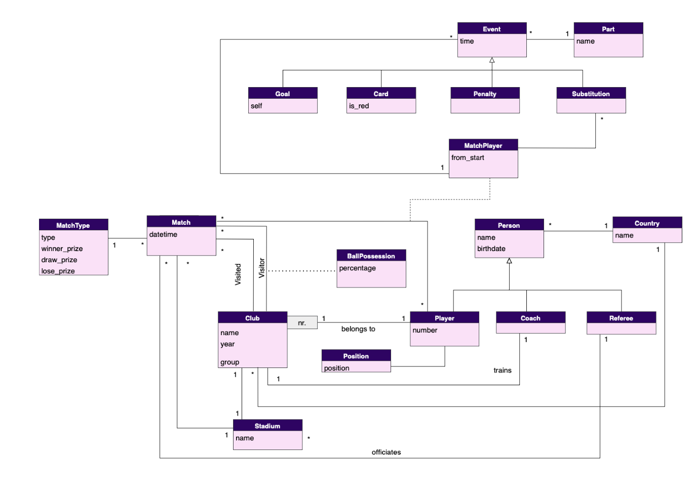

# A Database for the UEFA Champions League

## Overview

This repository contains a database project focused on the **UEFA Champions League**. The project is part of the coursework for the [Databases](https://sigarra.up.pt/feup/en/UCURR_GERAL.FICHA_UC_VIEW?pv_ocorrencia_id=501674) unit.

## Project Structure

The project is organized into the following components:

### Create & Populate

Two SQL scripts are provided for [creating](/src/create.sql) the database structure and [populating](/src/populate.sql) it with initial data.

The database is designed with the following UML structure:

### Queries

A directory containing 10 example [queries](/src/queries/) is provided to facilitate testing and exploring the database.

### Triggers

The `triggers` directory includes a set of 3 [triggers](/src/triggers/),, each consisting of three files:

* `triggerX_add.sql`: Creates the trigger.
* `triggerX_remove.sql`: Removes the trigger.
* `triggerX_verify.sql`: Tests the trigger.

## Usage

To set up the database, execute the `create.sql` script followed by the `populate.sql` script. The provided queries and triggers can be used to interact with and test the database.

## Other Information

For detailed insights into the project, please refer to the [Report](/Report.pdf).
